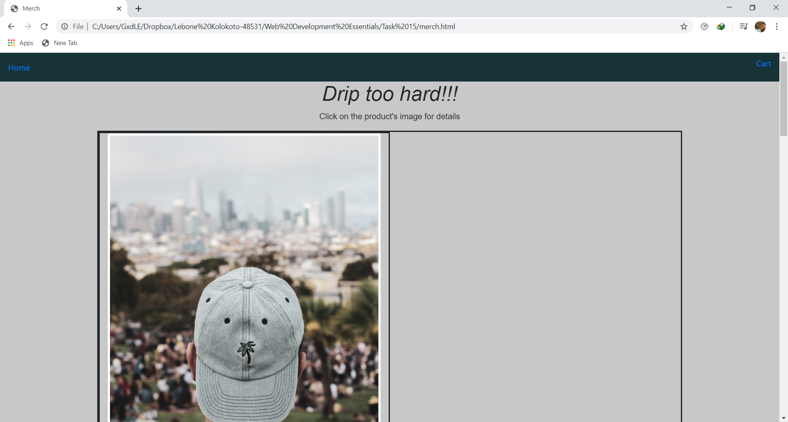
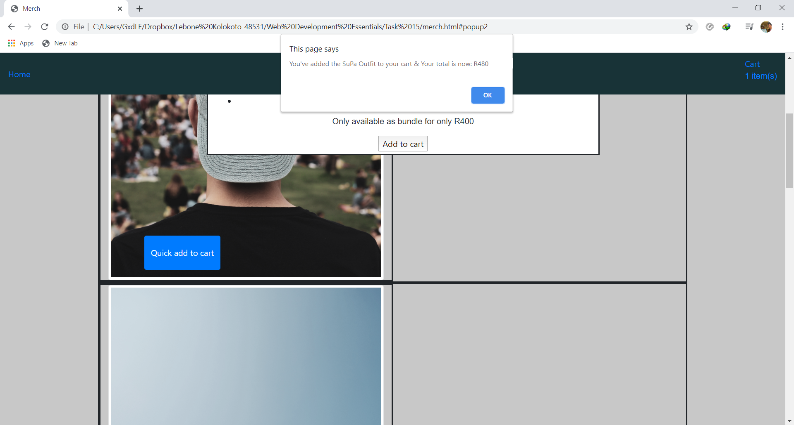
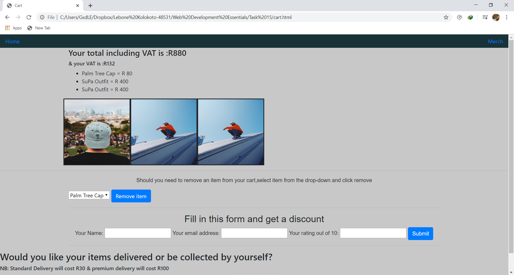
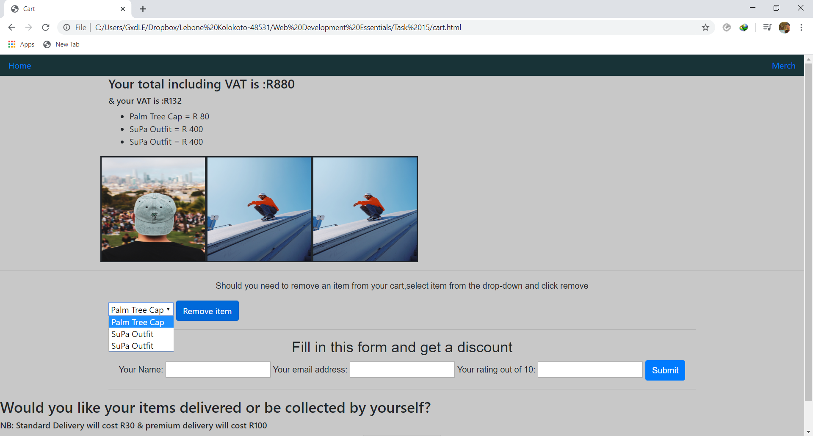
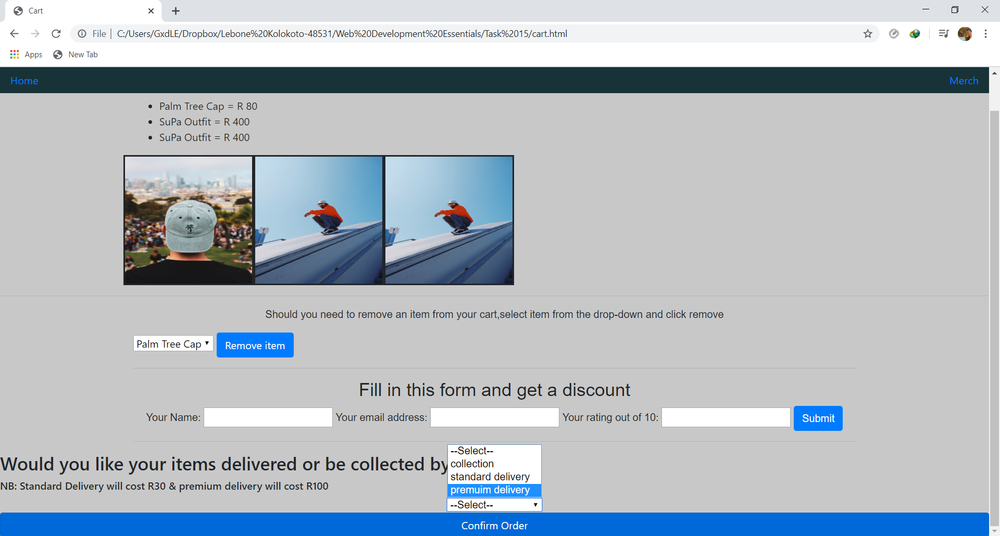

# myOnlineStore
This project is an interactive online store where one can buy clothing.

### Contents
1. How to install the project locally on your machine.
1. How to use my store.
1. Credits.

## How to install it on your machine.
#### Step 1
Open GitBash then change your directory to where you want to work from.
#### Step 2
Use the git clone command followed by https://github.com/Lebone-K/myOnlineStore.git

## How to use my store.
* Navigate to the merch page using the nav bar and the catalogue should show up as seen below.

* You can then add items to the cart and your total gets displayed.

* Open the cart at the top right and it should show up as seen below.

* You can remove items by selecting the item on the drop-down and clicking remove item.

* You can also apply a discount by filling in the discount form and clicking submit.

* Choose your delivery options and click confirm

## Credit
Code written by: Lebone-K
